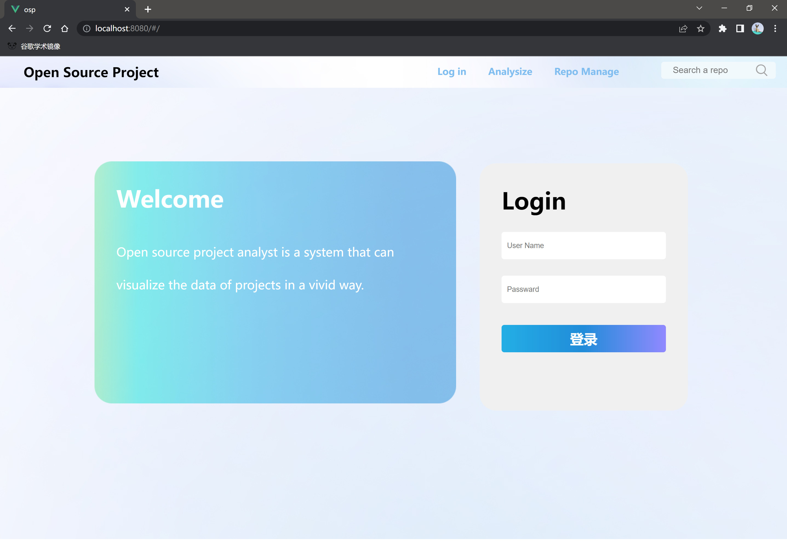

# Install File

> “开源项目分析平台2.0”是一个前后端分离项目，您可以遵循以下步骤完成对本项目的安装和配置。

## 1 克隆项目

在执行本操作前，请您确保本地已经安装了[Git](https://git-scm.com/) 

```shell
# 您可以使用以下命令完成对本项目的克隆
git clone https://github.com/BevisChou/Open-Source-Analysis-Platform.git
# 随后通过以下命令进入项目目录
cd Open-Source-Analysis-Platform-main
```

## 2 前端项目配置与运行

在运行前端项目前，请确保您的电脑中已经安装了 [Node](http://nodejs.org/) 与 [Vue Cli](https://cli.vuejs.org/zh/guide/).

### 2.1 环境配置

#### 安装依赖

​	请您打开前端项目文件夹 `frontend `，检查该路径下是否存在  `node_modules ` 文件夹和 `package-lock.json` 文件：若存在，请将两者删除；若不存在则直接进入下一步；

​	打开终端并将其定位至**前端项目根目录** `frontend ` ，运行 `npm install`  指令以安装项目依赖。若下载速度较慢，可以尝试使用 `npm install --registry=https://registry.npm.taobao.org`。
​	出现 `added 953 packages, and audited 954 packages in 1m` 字样表示安装成功。此时根目录下将新增 `node_modules` 文件夹。

### 2.2 运行

​	在前端项目根目录下执行命令 `npm run serve` 以运行项目。

​	终端中出现以下字样表示前端项目运行成功，您可以通过其中任意一个网址访问前端项目：

```bash
  App running at:
  - Local:   http://localhost:8080/
  - Network: http://ip address:8080/
```

​	正常运行的前端界面如下如所示：



<center>为保证您的体验，建议使用 Chrome 浏览器</center>

## 3 后端项目配置与运行

我们建议您使用 Docker 运行后端项目，若您还未安装，则可以参照该 [教程](https://docs.docker.com/get-docker/) 进行操作。

### 3.1 环境配置

若您安装了 Docker，请使用以下命令创建并运行一个新的 ubuntu 实例：

```dockerfile
docker run -dit -p 8000:8000 ubuntu
```

#### 安装依赖

在新增实例的终端键入以下命令以安装后端项目正确运行所必须的依赖：

```bash
# 更新源
apt update

# 安装 git
apt install -y git

# 安装 python
apt install -y python3
# 创建软连接，使默认版本更换为 python3
ln -s /usr/bin/python3 /usr/bin/python

# 安装 pip
apt install -y python3-pip

# 安装 Django 和用于处理跨域请求的 django-cors-headers
python -m pip install Django
python -m pip install django-cors-headers

# 安装 mysql
apt install mysql-server

# 安装 mysql client
apt install python3-dev default-libmysqlclient-dev build-essential
pip install mysqlclient

# 安装 PyGithub
python -m pip install PyGithub

# 安装 numpy
python -m pip install numpy

# 安装 celery
apt install redis
pip install -U "celery[redis]"
pip install django-celery-beat
```

#### MySQL设置

​	由于后端项目需要对 MySQL 数据库进行读写，请按照以下步骤完成必要操作：

1. 首先，在终端中运行以下指令以登录 MySQL ：

```bash
mysql -u root -p 密码
```

2. 在 MySQL 中输入以下指令：

```mysql
# 更改 root 用户的密码为 1123
ALTER USER 'root'@'localhost' IDENTIFIED BY '1123';

# 创建名为 mini_oss_insight 的数据库
CREATE DATABASE mini_oss_insight;
```

3. 退出 MySQL，在<u>**后端项目根目录下**</u>运行以下指令完成数据库初始化：

```bash
python manage.py makemigrations
python manage.py migrate
```

### 3.2 运行

> 在运行过程中请确保 **<u>网络连通</u>** ！

在后端项目中开启两个终端，分别运行下列指令：

#### Terminal 1

```bash
# 启动 MySQL 服务
service mysql start
# 启动 Django 项目
python manage.py runserver 0.0.0.0:8000

# 启动带有Django环境的Python交互式解释器
python manage.py shell
# 待进入命令行环境后，运行以下指令
import scripts.puller_example.py
```

#### Terminal 2

```bash
# 启动 MySQL 服务
service mysql start
# 启动 Django 项目
python manage.py runserver 0.0.0.0:8000

# 启动带有Django环境的Python交互式解释器
python manage.py shell
# 待进入命令行环境后，运行以下指令
import scripts.fetcher_example.py
```

## 4 项目运行的两种方式

> 由于本项目后端项目将对 GitHub 所有项目的 Event 进行爬取与筛选分析，数据处理时间成本较高。
>
> 基于该情况，本项目准备了已经爬取、分析完毕的数据供前端进行渲染，以保障流畅的用户体验；
> 若您想实时进行爬取和渲染，则可以同时运行前后端项目。

### 4.1 基于已爬取的数据运行 

​	**仅运行前端项目**：该方式将提供更加流畅的用户体验。

### 4.2 重新爬取数据并运行 

​	**同时运行前后端项目**：该方式支持实时爬取、更新项目数据，但后端数据处理速度较为缓慢。
