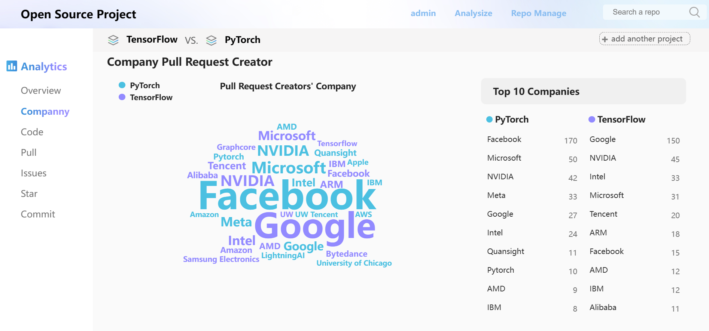

# README


<center>
    
    
    
    
    
    
    
</center>

---

<center>界面预览</center>



​	“开源项目分析平台”提供了一个降低开发者对托管在不同平台上的开源项目进行便捷分析、比较的一站式解决方案，旨在降低用户获取、分析开源项目数据的门槛。通过对开源项目的社区活跃程度、贡献者信息、设计讨论数据进行分析和可视化呈现，帮助开发者深入挖掘项目数据中的潜在信息，更好的把握项目开发现状。

​	本平台无需登录。数据通过 GitHub 相关接口完成爬取，在完成分析后存储在服务端数据库中，使用体验流畅。用户可以通过时间戳识别数据的最后更新时间，并根据需要对其进行更新。

## 1 目录

```
.
└── Open-Source-Analysis-Platform-main
    ├── LICENSE
    ├── README.md
    ├── INSTALL.md
    ├── PROCESS FILE.md
    ├── img    
    ├── backend
    │   ├── fetcher
    │   ├── manage.py
    │   ├── mysite
    │   ├── puller
    │   ├── scripts
    │   └── usr
    ├──  frontend
    │   ├── README.md
    │   ├── babel.config.js
    │   ├── jsconfig.json
    │   ├── package.json
    │   ├── public
    │   ├── src
    │   └── vue.config.js
    └── original-version
        ├── README.md
        ├── app
        ├── djangoproject
        ├── manage.py
        ├── static
        └── templates
```

## 2 功能

```
- 管理员
  - 注册
  - 登录
  - 注销

- 前端
  - 单仓库数据可视化（提供筛选功能）
    - Company issue creators, pull request creators and stargazers
    - Responded time and history of issues 
    - Time cost and history of pull requests
    - Changes of code lines
    - Commit history
    - Star history
 - 多仓库数据对比
   （默认对比 Pytorch 和 Tensorflow）
   
- 后端
  - 添加监视项目
  - 删除监视项目
```

## 3 安装

> 在使用本项目前，您需要确保本地已经安装了 [Git](https://git-scm.com/),  [Node](http://nodejs.org/),  [Vue Cli](https://cli.vuejs.org/zh/guide/) 与 [Docker](https://docs.docker.com/get-docker/),
> 具体安装与配置过程可以参考 [Install File](#)。

### 克隆本项目

```bash
# 在终端运行以下命令以克隆本项目
git clone https://github.com/BevisChou/Open-Source-Analysis-Platform.git

# 通过以下命令进入项目根目录
cd Open-Source-Analysis-Platform-main
```

### 前端项目运行

```bash
# 进入前端项目根目录
cd frontend 

# 执行以下命令以运行项目
npm run serve

# 若运行成功，您可以通过以下地址访问前端界面
http://localhost:8080/
```

### 后端项目运行

> 我们建议您使用 Docker 运行后端项目。
> 开启**两个终端**，分别运行下列指令：

#### Terminal 1

```bash
# 启动 MySQL 服务
service mysql start
# 启动 Django 项目
python manage.py runserver 0.0.0.0:8000

# 启动带有Django环境的Python交互式解释器
python manage.py shell
# 待进入命令行环境后，运行以下指令
import scripts.puller_example.py
```

#### Terminal 2

```bash
# 启动 MySQL 服务
service mysql start
# 启动 Django 项目
python manage.py runserver 0.0.0.0:8000

# 启动带有Django环境的Python交互式解释器
python manage.py shell
# 待进入命令行环境后，运行以下指令
import scripts.fetcher_example.py
```

## 4 支持

​	“开源项目分析平台”支持现代浏览器及 10.0 以上版本的 IE 浏览器。


| <br/>IE / Edge | <br/>Firefox | <br/>Chrome | <br/>Safari |
| :----------------------------------------------------------: | :----------------------------------------------------------: | :----------------------------------------------------------: | :----------------------------------------------------------: |
|                      IE10,  IE11,  Edge                      |                        最新的2个版本                         |                        最新的2个版本                         |                        最新的2个版本                         |


## 5 开发者

<center><a href="https://github.com/kylin11-ll"><br /><b>Ky Lin</b></a></center>
<center><a href="https://https://github.com/BevisChou"><br /><b>Bevis Chou</b></a></center>
<center><a href="https://github.com/Pikachu-Yuhang"><br /><b>Pikachu Yuhang</b></a></center>
<center><a href="https://github.com/KUNE1008"><br /><b>Kun</b></a></center>
<center><a href="https://github.com/triplepiers/"><br /><b>Shen</b></a></center>

