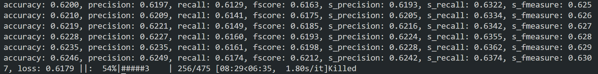

<!-- _backgroundColor: #305245 -->
<!-- _footer: 3200104392 沈韵沨-->
<h1 class="p1">FRMiner</h1>

Let's try the replication package !

---
<!-- paginate: true -->
<!-- footer: FRMiner - Try the replication package -->
<!-- h2.color: #AAD0AC -->
# 1 How I Run the Replication Package ?
<h2 class="p2"> > Part 1 - With WSL2</h2>
<h2 class="p2"> > Part 2 - With Docker</h2>

---
<!-- header: 1 How I Run the Replication Package ?-->
# Part 1 - With WSL2 [Failed]
**Environment:** Ubuntu-18.04(WSL2) & Python 3.6.4

**Steps:**
1. Add third-party pip mirror resource via：
`pip config set global.index-url https://pypi.tuna.tsinghua.edu.cn/simple` 
2. Install allennlp 0.8.4 via： `pip install allennlp==0.8.4`
3. Download code & trainning data. Unzip and adjust the file structure.
4. Run code via：`allennlp train <config file> -s <serialization path> -f --include-package FRMiner`
---
# Part 2 - With Docker [Failed]
Using WSL2-based Engine.

**Steps:**
1. Install Docker 20.10.17
2. Pull Docker Image via：`docker pull zzyo/frminer:v1`
3. Create Container via：`docker run -it zzyo/frminer:v1 /bin/bash`
4. Enter Folder `home`  and Run code：
`allennlp train FRMiner/config.json -s FRMiner/out/ -f --include-package FRMiner`

---
<!-- _header: "" -->
# 2 Obstacles & Solutions
<h2 class="p2"> > Unfortunately, we failed in both WSL2 and Docker.</h2>

---
<!-- header: 2 Obstacles & Solutions-->
# Part 1 - In WSL2
## > Ubuntu 22.04</h2>
1. `ERROR: No matching distribution found for allennlp==0.8.4`
We tired to add a third-party pip mirror resource, whereas there are still many other errors. Finally, we install the newiest version of allennlp (Ver 2.10.0).
2. `ModuleNotFoundError`
Fix by installing  `allennlp.models` 
3. `ImportError: cannot import name 'OrderedDict' `
It has been deprecated from Python 3.9, thus, we tried to use Ubuntu 18.04.
  
---
# Part 1 - In WSL2
## > Ubuntu 18.04</h2>
1. Swith the default Python Version.
The default python version in Ubuntu18.04 is 2.7, we use `update-alternatives --config python` to change it to 3.6
2. Use `pip3 install` instead of `pip install`
3. `TypeError: ArrayField.empty_field: return type None is not a <class 'allennlp.data.fields.field.Field'>`
It appears to be because the latest package breaks the older versions of allennlp. Thus, we tried to use Docker.

---
# Part 2 - In Docker
## > Using WSL2-based Engine
Firstly, the proccess was killed at 27%, using 12.8GB Memory (80% of the total). 

We use '.wslconfig` to maximze the memory to 16GB, but the process was killed at 54%.

---

# 3 Are thr results are consistent with the paper?
## Unfortunately, 
## Since my computer couldn't finish the training process, 
<h2> I'm UNABLE to answer this question. </h2>